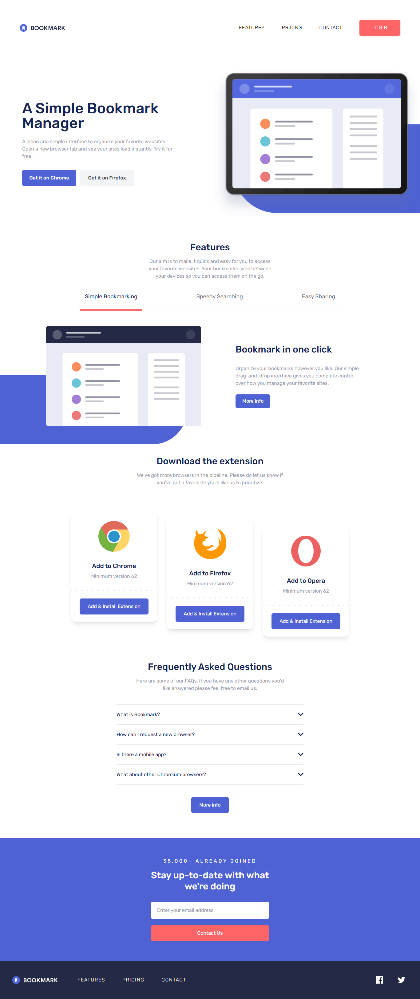

# Frontend Mentor - Bookmark landing page solution

This is a solution to the [Bookmark landing page challenge on Frontend Mentor](https://www.frontendmentor.io/challenges/bookmark-landing-page-5d0b588a9edda32581d29158). Frontend Mentor challenges help you improve your coding skills by building realistic projects.

## Table of contents

- [Overview](#overview)
  - [The challenge](#the-challenge)
  - [Screenshot](#screenshot)
  - [Links](#links)
- [My process](#my-process)
  - [Built with](#built-with)
  - [What I learned](#what-i-learned)
- [Author](#author)

## Overview

### The challenge

Users should be able to:

- View the optimal layout for the site depending on their device's screen size
- See hover states for all interactive elements on the page
- Receive an error message when the newsletter form is submitted if:
  - The input field is empty
  - The email address is not formatted correctly

### Screenshot

### Links

- Solution URL: [Frontend Challenge Solution](https://www.frontendmentor.io/solutions/bookmark-landing-page-HZhjhXDHwy)
- Live Site URL: [Bookmark Landing Page](https://gustavo2023.github.io/bookmark-landing-page/)

## My process

### Built with

- Semantic HTML5 markup
- CSS custom properties
- Flexbox
- Mobile-first workflow
- Tailwind CSS

### What I learned

- **Tailwind fluency through repetition:** Learned to translate visual designs directly into utility classes (spacing, flex/grid layout, responsive breakpoints, arbitrary values, pseudo-element utilities like `after:`) without writing custom CSS for most components.
- **Responsive mindset first:** Mobile‑first classes (`md:` overrides) helped keep base styles lean and clarified when to promote layout changes (nav overlay -> inline desktop menu, hero layout reversal, tablist alignment).
- **Managing complex interactive states with utilities:** Used `transition` + `transform` + `opacity` utilities to prototype animations quickly, then refined for performance and reduced motion; replaced Y translate with simpler X fade to eliminate visual delay.
- **Component refactor discipline:** Broke a monolithic script into feature modules (`navbar`, `feature-tabs`, `accordion`, `contactForm`) plus shared utilities (`motion`, `feature-tabs-helpers`, `navbar-helpers`, `emailValidation`) enabling clearer ownership and easier future changes.
- **Accessibility baked into HTML first:** Leveraged semantic elements (`nav`, `header`, `main`, `section`, `h1`/`h2` hierarchy, `role="region"` for accordion panels) and ARIA attributes only where needed (e.g. `aria-controls`, `aria-selected`, `aria-expanded`, `aria-hidden`, `aria-labelledby`).
- **Roving tabindex & ARIA tabs pattern:** Implemented an accessible tabs system (proper `role="tablist"`, `role="tab"`, `role="tabpanel"`, synchronized `aria-selected`, `tabIndex`, and panel visibility) adhering to WAI‑ARIA Authoring Practices.
- **Focus management & inert usage:** Ensured mobile nav did not trap or expose hidden interactive elements by toggling visibility, `aria-hidden`, and using an inert strategy so assistive tech and keyboard users only interact with the active surface.
- **Reduced motion respect:** Centralized `prefers-reduced-motion` detection in a shared utility to guarantee all animations (tabs, accordion) degrade gracefully for users who prefer minimal motion.
- **Pure helper functions for testability:** Extracted pure logic (e.g., `computeNextIndex`, `findCurrentTab`, `isValidEmail`) so behavior can be reasoned about without DOM side effects, reducing cognitive load.
- **Accessible form validation:** Used `aria-invalid`, `aria-describedby`, `role="alert"`, and unobtrusive visual states (container background + icon) to deliver clear error feedback while keeping screen reader output concise.
- **State represented through attributes:** Relied on ARIA & HTML (`hidden`, `aria-expanded`, `aria-selected`) as single sources of truth and derived visual styles from those attributes, minimizing redundant class state flags.

## Author

- Frontend Mentor - [@gustavo2023](https://www.frontendmentor.io/profile/gustavo2023)
